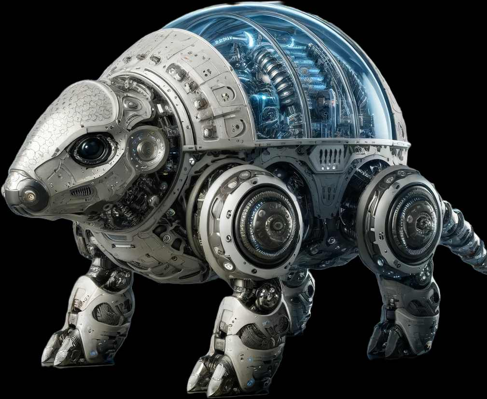

# Brain

Move Slow and Break Things

## POGO

Prototype - Staging area for new ideas   
Ongoing - Research   
Glyptodont - Self-contained armoured shell   
Obfuscarium - A soundproof room   

## Adapted from the PARA method

Projects   
Areas   
Resources   
Archives   

## For more information see:

[Para Method](https://workflowy.com/systems/para-method/)   
[Glyptodont](https://en.wikipedia.org/wiki/Glyptodont)   
[Move Slow](https://lux-magazine.com/article/move-slow-and-break-things/)   
[Soundproof Room](https://forum.rpg.net/index.php?threads/lets-read-adventure-companion-fantasy-craft.856383/page-2#post-23007222)   
