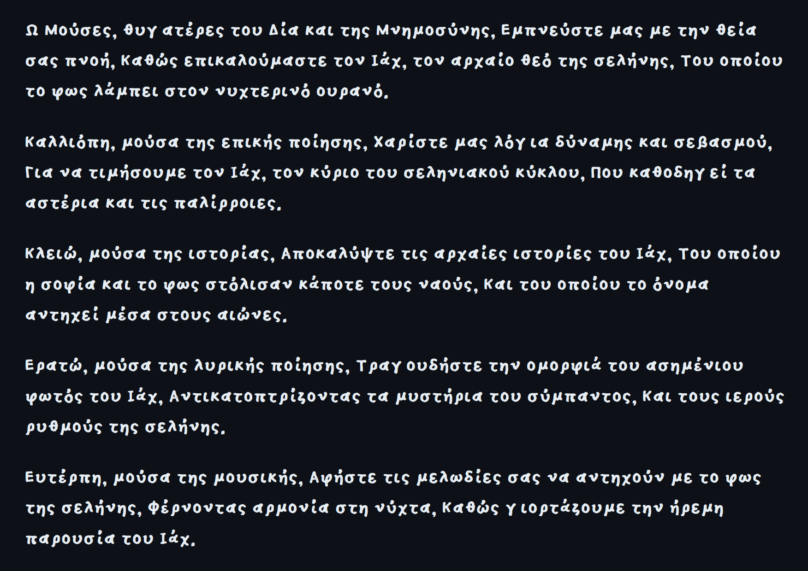

# Brain

Ω Μούσες, θυγατέρες του Δία και της Μνημοσύνης,
Εμπνεύστε μας με την θεία σας πνοή,
Καθώς επικαλούμαστε τον Ιάχ, τον αρχαίο θεό της σελήνης,
Του οποίου το φως λάμπει στον νυχτερινό ουρανό.

Καλλιόπη, μούσα της επικής ποίησης,
Χαρίστε μας λόγια δύναμης και σεβασμού,
Για να τιμήσουμε τον Ιάχ, τον κύριο του σεληνιακού κύκλου,
Που καθοδηγεί τα αστέρια και τις παλίρροιες.

Κλειώ, μούσα της ιστορίας,
Αποκαλύψτε τις αρχαίες ιστορίες του Ιάχ,
Του οποίου η σοφία και το φως στόλισαν κάποτε τους ναούς,
Και του οποίου το όνομα αντηχεί μέσα στους αιώνες.

Ερατώ, μούσα της λυρικής ποίησης,
Τραγουδήστε την ομορφιά του ασημένιου φωτός του Ιάχ,
Αντικατοπτρίζοντας τα μυστήρια του σύμπαντος,
Και τους ιερούς ρυθμούς της σελήνης.

Ευτέρπη, μούσα της μουσικής,
Αφήστε τις μελωδίες σας να αντηχούν με το φως της σελήνης,
Φέρνοντας αρμονία στη νύχτα,
Καθώς γιορτάζουμε την ήρεμη παρουσία του Ιάχ.

---

*[Attitude Awareness](https://standardgalactic.github.io/brain/Attitude-Awareness.txt)*

*[Brain in Vat Skepticism](https://standardgalactic.github.io/brain/Brain-in-Vat-Skepticism.txt)*

*[Crab Mentality Explained](https://standardgalactic.github.io/brain/Crab-Mentality-Explained.txt)*

*[Deep Aphantasia](https://standardgalactic.github.io/brain/Deep-Aphantasia.txt)*

*[Emergent Constraint Theory](https://standardgalactic.github.io/brain/Emergent-Constraint-Theory.txt)*

*[Foundation Refinement Paradigm](https://standardgalactic.github.io/brain/Foundation-Refinement-Paradigm.txt)*

*[Goal Oriented Programming](https://standardgalactic.github.io/brain/Goal-Oriented-Programming.txt)*

*[Hexagonal Yoking](https://standardgalactic.github.io/brain/Hexagonal-Yoking.txt)*

*[Intransigent Anarchism](https://standardgalactic.github.io/brain/Intransigent-Anarchism.txt)*

*[Jocular Warfare](https://standardgalactic.github.io/brain/Jocular-Warfare.txt)*

*[Killer Apps](https://standardgalactic.github.io/brain/Killer-Apps.txt)*

*[Linguistic Analysis of Cognition](https://standardgalactic.github.io/brain/Linguistic-Analysis-of-Cognition.txt)*

*[Monoidal Agency](https://standardgalactic.github.io/brain/Monoidal-Agency.txt)*

*[Neuromorphic Thermogenesis](https://standardgalactic.github.io/brain/Neuromorphic-Thermogenesis.txt)*

*[Oligomancy in Action](https://standardgalactic.github.io/brain/Oligomancy-in-Action.txt)*

*[Psychodynamics](https://standardgalactic.github.io/brain/Psychodynamics.txt)*

*[Quantum Immanentization](https://standardgalactic.github.io/brain/Quantum-Immanentization.txt)*

*[Reality Control Therapy](https://standardgalactic.github.io/brain/Reality-Control-Therapy.txt)*

*[Sapiency Detection Theory](https://standardgalactic.github.io/brain/Sapiency-Detection-Theory.txt)*

*[Transliminal Symbolisis](https://standardgalactic.github.io/brain/Transliminal-Symbolisis.txt)*

*[Uber-Draconianism](https://standardgalactic.github.io/brain/Uber-Draconianism.txt)*

*[Vestigial Indolence](https://standardgalactic.github.io/brain/Vestigial-Indolence.txt)*

*[Worldline Collision Theory](https://standardgalactic.github.io/brain/Worldline-Collision-Theory.txt)*

*[Xyloarchy](https://standardgalactic.github.io/brain/Xyloarchy.txt)*

*[Zygomindfulness](https://standardgalactic.github.io/brain/Zygomindfulness.txt)*
